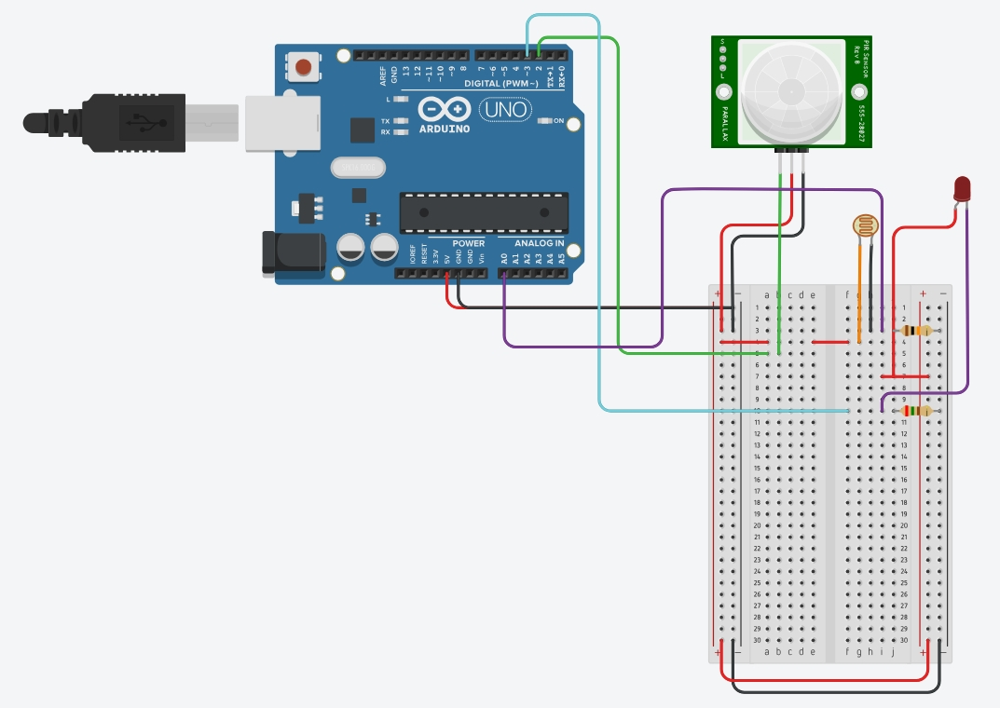

# **Tutorial: Controle Inteligente de Iluminação com IoT**

Este tutorial mostra como criar um sistema IoT para controle inteligente de iluminação em ambientes médicos, como salas de espera ou consultórios. Ele ajustará a iluminação automaticamente com base na presença de pessoas e nas condições de luz ambiente(utilizando sensores PIR HC-SR501 e Sensores de Luz LDR), otimizando o conforto e a eficiência energética.

---

## **Sumário**

- [**Tutorial: Controle Inteligente de Iluminação com IoT**](#tutorial-controle-inteligente-de-iluminação-com-iot)
  - [**Sumário**](#sumário)
  - [**Objetivo do Projeto**](#objetivo-do-projeto)
  - [**Componentes Necessários**](#componentes-necessários)
  - [**Esquema de Conexão**](#esquema-de-conexão)
    - [**1. Conexão do Sensor PIR**](#1-conexão-do-sensor-pir)
    - [**2. Conexão do Sensor de Luz (LDR)**](#2-conexão-do-sensor-de-luz-ldr)
    - [**3. Conexão da Lâmpada LED**](#3-conexão-da-lâmpada-led)
  - [**Exemplo de esquema feito no ThinkerCad**](#exemplo-de-esquema-feito-no-thinkercad)
  - [**Código do Projeto**](#código-do-projeto)
  - [**Funcionamento**](#funcionamento)
  - [**Testando o Sistema**](#testando-o-sistema)
  - [**Possíveis Melhorias**](#possíveis-melhorias)
  - [**Conclusões**](#conclusões)

---

## **Objetivo do Projeto**

Desenvolver um sistema IoT para controle de iluminação que:  

- Detecta automaticamente a presença de pessoas no ambiente.  
- Mede a intensidade da luz ambiente.  
- Liga e desliga uma lâmpada LED com base nas condições detectadas.  

Esse sistema é útil em hospitais e clínicas para:  

- Garantir conforto visual durante exames e consultas.  
- Reduzir o consumo de energia elétrica em ambientes com pouca ocupação.  

---

## **Componentes Necessários**

1. **Hardware**
   - Arduino Uno
   - Sensor PIR (exemplo: HC-SR501) para detecção de presença
   - Sensor de luz ambiente (LDR)
   - Lâmpada LED ou faixa de LEDs
   - Driver de LED ou módulo relé
   - Resistor de 10k ohms para o LDR
   - Resistor de 220 ohms para o LED
   - Protoboard
   - Jumpers

2. **Software**

   - IDE Arduino

---

## **Esquema de Conexão**

### **1. Conexão do Sensor PIR**

- **VCC** → 5V  
- **GND** → GND  
- **OUT** → Pino digital (ex: D2 no Arduino)  

### **2. Conexão do Sensor de Luz (LDR)**  

- **LDR**:  
  - Conecte em série com um resistor de 10k ohms entre o pino analógico A0 e o GND.  

### **3. Conexão da Lâmpada LED**

- O cátodo do LED (perna menor) vai ao GND.
- O ânodo do LED (perna maior) conecta-se ao pino D3 por meio de um resistor de 220 ohms.

---

## **Exemplo de esquema feito no ThinkerCad**



---

## **Código do Projeto**

```cpp
const int pirPin = 2;       // Pino do sensor PIR
const int ledPin = 3;       // Pino do LED
const int ldrPin = A0;      // Pino do sensor LDR
const int lightThreshold = 500; // Limiar de luz para ativar o LED (ajustável)

unsigned long lastMotionTime = 0; // Armazena o tempo da última detecção de movimento
const unsigned long lightDuration = 10000; // Duração em milissegundos (10 segundos)

void setup() {
  pinMode(pirPin, INPUT);
  pinMode(ledPin, OUTPUT);
  pinMode(ldrPin, INPUT);
  Serial.begin(9600);
}

void loop() {
  int pirState = digitalRead(pirPin);       // Leitura do sensor PIR
  int ldrValue = analogRead(ldrPin);        // Leitura do LDR

  Serial.print("Luz: ");
  Serial.print(ldrValue);
  Serial.print(" | Presenca: ");
  Serial.println(pirState);

  // Atualiza o tempo da última detecção se houver movimento
  if (pirState == HIGH) {
    lastMotionTime = millis();
  }

  // Verifica se deve ligar ou desligar a luz
  if (millis() - lastMotionTime < lightDuration && ldrValue < lightThreshold) {
    digitalWrite(ledPin, LOW); // Liga o LED
    Serial.println("Luz Ligada!");
  } else {
    digitalWrite(ledPin, HIGH); // Desliga o LED
    Serial.println("Luz Desligada!");
  }

  delay(500); // Atualiza a cada meio segundo
}

```

---

## **Funcionamento**

1. **Sensor PIR** detecta a presença de pessoas no ambiente:  
   - Quando alguém entra, o sistema verifica a luz ambiente.  
2. **Sensor de Luz** ajusta a iluminação:  
   - Se a luz ambiente for baixa, a lâmpada LED será ligada.  
   - Se a luz ambiente for suficiente, a lâmpada permanecerá desligada.  
3. **Controle Inteligente**:  
   - Após 10 segundos sem detecção de presença, a lâmpada será desligada para economizar energia.  

---

## **Testando o Sistema**

Isto pode ser feito através do simulador virtual TinkerCAD: [Link do projeto.](https://www.tinkercad.com/things/7C9WrRfNNbg-controle-inteligente-de-iluminacao-de-salas-corredores-e-patios)

1. Configure o hardware conforme o esquema.  
2. Carregue o código no Arduino usando a IDE Arduino.  
3. Verifique o funcionamento:  
   - Movimente-se na frente do sensor PIR e observe o LED acender.  
   - Ajuste a luminosidade da sala e veja como o sistema responde.  

---

## **Possíveis Melhorias**

1. **Controle por Aplicativo**  
   - Conecte o ESP32 à rede Wi-Fi e controle a iluminação via um aplicativo móvel.  

2. **Ajuste Dinâmico da Intensidade**  
   - Use PWM (Modulação por Largura de Pulso) para controlar a intensidade da lâmpada LED com base na luminosidade ambiente.  

3. **Relatórios e Monitoramento na Nuvem**  
   - Envie dados do consumo de energia e do uso do sistema para um painel online.  

4. **Detecção Multiambiente**  
   - Adicione múltiplos sensores PIR e LEDs para controlar diferentes áreas do ambiente de forma independente.  

5. **Aprimoramento do tempo de resposta e acionamento das luzes**
   - Verificar possíveis componentes de substituição para agilizar o acendimento das luzes, além de modificar o código para manter as luzes acesas por mais tempo.

---

## **Conclusões**

Este projeto demonstra de forma eficaz como integrar sensores de presença e de luz para criar um sistema inteligente de controle de iluminação, promovendo conforto e eficiência energética em ambientes médicos. A solução apresentada não só ajusta automaticamente a iluminação conforme a ocupação e as condições de luz ambiente, mas também otimiza o consumo de energia ao desligar as luzes após um período de inatividade.

Os testes realizados no simulador TinkerCAD, confirmam a funcionalidade do sistema e sua aplicabilidade prática. Além disso, a modularidade do projeto possibilita adaptações e melhorias futuras, como a integração com redes Wi-Fi para controle remoto, monitoramento de dados em tempo real e ajuste dinâmico da intensidade luminosa.

O sistema atende ao objetivo inicial de fornecer uma solução acessível e eficiente para ambientes hospitalares e similares. Com base nas sugestões de melhorias, há potencial para expandir o projeto, incorporando tecnologias de IoT mais avançadas e aumentando sua escalabilidade e personalização. Esse tutorial serve como um ponto de partida sólido para desenvolvedores e entusiastas interessados em criar sistemas de automação inteligentes e sustentáveis.
