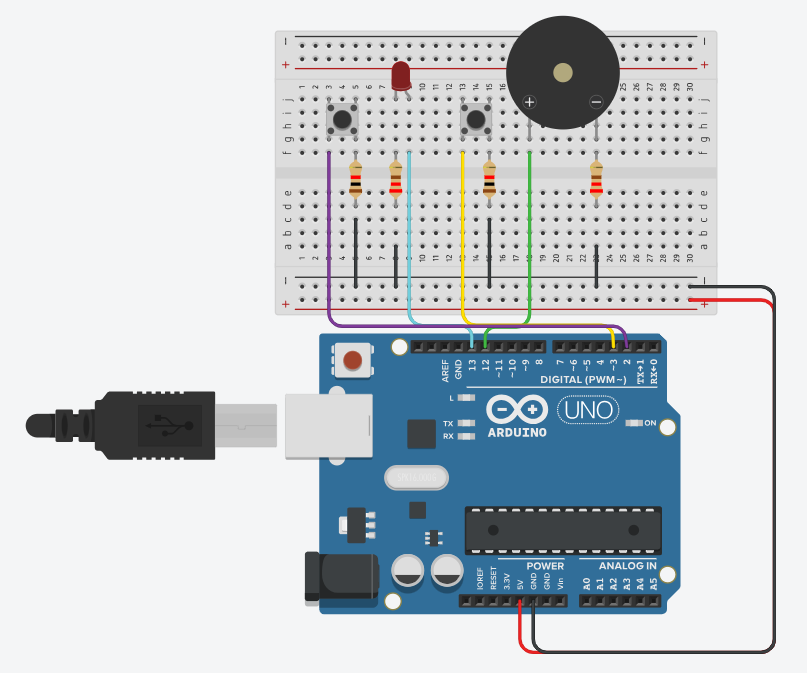

# Cronometro para Paciente

**Descrição:** Criação de um circuito utilizando Arduino Uno para indicar quando o paciente deve tomar o medicamento, com um alarme sonoro e um LED de indicação.

---

## Índice

1. [Introdução](#introdução)
2. [Requisitos](#requisitos)
3. [Configuração do Ambiente](#configuração-do-ambiente)
4. [Montagem do Circuito](#montagem-do-circuito)
5. [Programação](#programação)
6. [Teste e Validação](#teste-e-validação)
7. [Expansões e Melhorias](#expansões-e-melhorias)
8. [Referências](#referências)

---

## Introdução
O sistema de alerta foi desenvolvido para monitorar o tempo que um paciente deve tomar o medicamento, gerando um alarme sonoro e um LED indicador após um intervalo de 5 minutos (Escolhemos esse tempo apenas para demonstração). O sistema inclui dois botões: um para iniciar o contador de 5 minutos e outro para parar o alarme assim que o medicamento for tomado.


---

## Requisitos

### Hardware

- **Placa**: Arduino Uno R3;
- **Sensores**: Botões (2);
- **Atuadores**: LED, Buzzer (Alarme Sonoro);
- **Outros componentes**: Protoboard (fins educacionais), 4 resistores (2 de 220 ohms e 2 de 1kohms), jumpers, cabo usb.

### Software

- **Linguagens**: C para Arduino via Arduino IDE;
- **IDE**: Arduino IDE, Tinkercad (Opcional);
- **Bibliotecas**: Nenhuma biblioteca externa necessária.
---

## Configuração do Ambiente

### Passo 1: Instalação do Software

- **Arduino IDE**: Por meio do link (https://www.arduino.cc/en/software) faça o download do software que usaremos para programar a placa;

### Passo 2: Configuração da Placa

- **Arduino**: Passos para configurar a placa e selecionar a porta correta na IDE:
1. Conecte o arduino no computador via cabo usb;
2. Clique em:

   
3. Clique em Select other board and port;
4. Selecione a board Arduino Uno R3;
5. Por fim selecionar a Port.

---

## Montagem do Circuito

- **Botão de Início (Botão Esquerdo)**: Porta a1 conectada ao pino 2 do Arduino. Já a porta a2 está ligada ao GND passando por um resistor de 1k ohms. 
- **Botão de Parada (Botão Direito)**: Porta a1 conectada ao pino 3 do Arduino. Já a porta a2 está ligada ao GND passando por um resistor de 1k ohms. 
- **LED**: Anodo conectado ao pino 13 do Arduino. Já outra entrada está ligada ao GND passando por um resistor de 220 ohms.
- **Buzzer**: Lado positivo conectado ao pino 12 do Arduino. Já o lado negativo está ligado ao GND passando por um resistor de 220 ohms.
 
- Foto do Circuito:




---

## Programação

### Passo 1: Definição das Portas

- Com o circuito montado, vamos definir as portas utilizadas no Arduino IDE:
  
```cpp
const int ledPin = 13;        // Pino do LED
const int buttonStartPin = 2; // Pino do botão de iniciar (agora no pino 2)
const int buttonStopPin = 3;  // Pino do botão de parar (agora no pino 3)
const int buzzerPin = 12;     // Pino do buzzer
```

### Passo 2: Lógica do Sistema de Alerta

- Após configurar o LCD, vamos adicionar a lógica para o funcionamento do sistema
  
```cpp
unsigned long previousMillis = 0;  // Armazena o tempo desde a última verificação
const long interval = 300000;      // Intervalo de 5 minutos (300.000 ms)
bool alarmActive = false;  // Flag para controlar o estado do alarme
bool lastStartButtonState = HIGH; // Estado anterior do botão de iniciar
bool currentStartButtonState;   // Estado atual do botão de iniciar
bool lastStopButtonState = HIGH; // Estado anterior do botão de parar
bool currentStopButtonState;    // Estado atual do botão de parar
bool alarmDisabled = false; // Flag para desabilitar o alarme permanentemente
bool timerStarted = false;  // Flag para indicar que o timer foi iniciado

void setup() {
  pinMode(ledPin, OUTPUT);        // Configura o LED como saída
  pinMode(buzzerPin, OUTPUT);     // Configura o buzzer como saída
  pinMode(buttonStartPin, INPUT_PULLUP);  // Configura o botão de iniciar com pull-up interno
  pinMode(buttonStopPin, INPUT_PULLUP);   // Configura o botão de parar com pull-up interno
  digitalWrite(ledPin, LOW);      // Garante que o LED inicie desligado
  noTone(buzzerPin);              // Garante que o buzzer inicie desligado
}

void loop() {
  unsigned long currentMillis = millis();  // Lê o tempo atual

  // Verifica se o botão de iniciar foi pressionado (mudança de HIGH para LOW)
  currentStartButtonState = digitalRead(buttonStartPin);

  if (currentStartButtonState == LOW && lastStartButtonState == HIGH && !timerStarted && !alarmDisabled) {
    // Inicia a contagem de 5 minutos
    previousMillis = currentMillis;  // Reseta o tempo de referência
    timerStarted = true;              // Marca que o timer foi iniciado
    alarmActive = false;              // O alarme começa inativo até que o tempo passe
    delay(200);  // Debounce para evitar leituras múltiplas
  }

  // Verifica se o botão de parar foi pressionado (mudança de HIGH para LOW)
  currentStopButtonState = digitalRead(buttonStopPin);

  if (currentStopButtonState == LOW && lastStopButtonState == HIGH) {
    // Desativa o alarme permanentemente
    alarmActive = false;
    digitalWrite(ledPin, LOW);      // Desliga o LED
    noTone(buzzerPin);              // Desliga o buzzer
    alarmDisabled = true;           // Impede que o alarme seja reativado
    timerStarted = false;           // Reseta a flag de tempo para permitir reiniciar
    delay(200);  // Debounce para evitar leituras múltiplas
  }

  // Se o alarme não foi desabilitado e o timer foi iniciado, começa a contagem
  if (timerStarted && !alarmDisabled && (currentMillis - previousMillis >= interval)) {
    alarmActive = true;            // Ativa o alarme após 5 minutos
  }

  // Se o alarme estiver ativo, aciona o LED e o buzzer
  if (alarmActive) {
    digitalWrite(ledPin, HIGH);  // Liga o LED
    tone(buzzerPin, 1000);       // Emite som no buzzer
  }

  // Atualiza os estados anteriores dos botões
  lastStartButtonState = currentStartButtonState;
  lastStopButtonState = currentStopButtonState;
}
```
---

## Teste e Validação

1. **Testando Atuadores**: O LED e o buzzer devem ligar juntos após 5 minutos de contagem, quando o botão de iniciar for pressionado.
2. **Validação dos Sensores**: O contador de 5 minutos começa apenas após o pressionamento do botão de iniciar.
3. **Estado Normal**: Ao pressionar o botão de parada, o LED e o buzzer devem ser desligados permanentemente.
---

## Expansões e Melhorias

- **Alerta via Comunicação**: Integrar comunicação via Wi-Fi com um dispositivo móvel para receber alertas em tempo real.
- **Ajuste do Tempo de Alerta**: Permitir que o tempo de alerta seja ajustável pelo usuário, para notificações personalizadas.
- **Sensores Adicionais**: Adicionar sensores de temperatura ou pressão para monitoramento adicional da saúde do paciente.
---

## Referências

1. https://www.tinkercad.com/things/0AGIYzrofge-cronometro-medicamento?sharecode=QG3AHg3sttnB9kFDLHvF0CRrvwaY2t94L4rC_Bjr-5M
2. https://docs.arduino.cc/libraries/liquidcrystal/
3. https://www.arduino.cc/en/software
