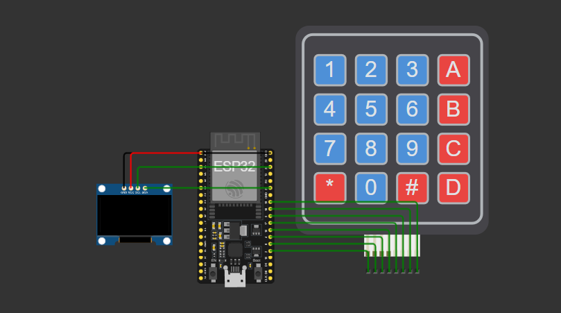

# Desenvolvendo um Sistema de Gerenciamento de Estoque de Medicamentos com ESP32 e Keypad

**Descrição:** Neste tutorial, vamos criar um sistema de gerenciamento de estoque de medicamentos utilizando uma ESP32, um teclado matricial (keypad), e um display SSD1306. O objetivo é cadastrar, exibir e retirar medicamentos do estoque, com a interação do usuário através do teclado e a visualização dos dados no display OLED. Durante este tutorial, você aprenderá a integrar o ESP32 com o keypad, exibir informações no display OLED, e manipular dados de um estoque de medicamentos.

---

## Índice

1. [Introdução](#introdução)
2. [Requisitos](#requisitos)
3. [Configuração do Ambiente](#configuração-do-ambiente)
4. [Montagem do Circuito](#montagem-do-circuito)
5. [Programação](#programação)
6. [Teste e Validação](#teste-e-validação)
7. [Expansões e Melhorias](#expansões-e-melhorias)
8. [Referências](#referências)

---

## Introdução

Neste projeto, você aprenderá a desenvolver um sistema de gerenciamento de estoque de medicamentos. O sistema permite ao usuário cadastrar medicamentos no estoque, exibir os remédios cadastrados e retirar medicamentos, tudo através de um teclado e visualizado em tempo real em um display OLED. Este sistema pode ser integrado a ambientes de saúde e farmácias, ajudando no controle de medicamentos e seus respectivos códigos.

O projeto envolve a comunicação entre o microcontrolador ESP32, um display OLED e um teclado matricial (keypad), formando um sistema interativo de cadastro e gerenciamento. Este é um exemplo prático de como a Internet das Coisas (IoT) pode ser utilizada para controlar e monitorar processos, como o gerenciamento de inventário em uma farmácia.

---

## Requisitos

### Hardware

- **Placa**: ESP32
- **Sensores**: Display OLED SSD1306 (128x64), Teclado Matricial 4x4
- **Outros componentes**: Jumpers, Fonte de alimentação para o ESP32, Protoboard (opcional)

### Software

- **Linguagens**: MicroPython (para programar o ESP32)
- **IDE**: Thonny para programação do ESP32 em MicroPython
- **Bibliotecas**: `ssd1306` (para o display OLED), `machine` (para manipulação dos pinos GPIO do ESP32) e `time` (para funções de tempo)

---

## Configuração do Ambiente

### Passo 1: Instalação do Software

- **Thonny Python**: Configuração do Thonny para programar em Python.
- **MicroPython para ESP32**: Baixe e instale o firmware do MicroPython para ESP32 e conecte o ESP32 ao seu computador e configure o Thonny para usar o MicroPython.
- **Bibliotecas**: No Thonny, instale as bibliotecas necessárias para o display SSD1306:

```bash
# Instalar bibliotecas do Python
pip install ssd1306
```

### Passo 2: Configuração das Placas

- **ESP32**:ESP32: Conecte o ESP32 ao computador via USB e configure-o na IDE Thonny. 

---

## Montagem do Circuito

Aqui está um diagrama simplificado para conectar o teclado matricial e o display OLED ao ESP32:

Teclado Matricial 4x4:

Pinos das linhas (LINHAS): GPIO 2, GPIO 0, GPIO 4, GPIO 16
Pinos das colunas (COLUNAS): GPIO 17, GPIO 5, GPIO 18, GPIO 19
Display OLED SSD1306 (I2C):

Pino SDA: GPIO 21
Pino SCL: GPIO 22

Link da simulação: [Simulação no Wokwi](https://wokwi.com/projects/415806447024476161)


---

## Programação

### Passo 1: Configuração do Teclado e Display

# Código Python para Sistema de Gerenciamento de Estoque de Medicamentos com ESP32 e Keypad

```python
from machine import Pin, I2C
import time
import ssd1306
import sys

# Definir os pinos para o Keypad
linhas = [Pin(2, Pin.OUT), Pin(0, Pin.OUT), Pin(4, Pin.OUT), Pin(16, Pin.OUT)]
colunas = [Pin(17, Pin.IN, Pin.PULL_UP), Pin(5, Pin.IN, Pin.PULL_UP), Pin(18, Pin.IN, Pin.PULL_UP), Pin(19, Pin.IN, Pin.PULL_UP)]

# Mapeamento do teclado (matriz 4x4)
teclas = [
    ['1', '2', '3', 'A'],
    ['4', '5', '6', 'B'],
    ['7', '8', '9', 'C'],
    ['*', '0', '#', 'D']
]

# Inicializar I2C para o display SSD1306
i2c = I2C(0, scl=Pin(22), sda=Pin(21), freq=400000)  # Pinos SDA e SCL
oled = ssd1306.SSD1306_I2C(128, 64, i2c)  # Display 128x64 pixels

# Função para escanear o teclado
def escanear_teclado():
    for i in range(4):
        linhas[i].value(0)  # Definir a linha atual como LOW
        for coluna_num in range(4):
            if not colunas[coluna_num].value():
                for linha_num in range(4):
                    linhas[linha_num].value(1)  # Desligar todas as linhas
                return teclas[i][coluna_num]
        linhas[i].value(1)  # Desligar linha atual
    return None

# Lista para armazenar os remédios e seus códigos
lista_remedios = []

# Função para mostrar os remédios no display
def mostrar_remedios():
    oled.fill(0)
    oled.text("Remédios cadastrados:", 0, 0)
    
    for i, remedio in enumerate(lista_remedios[-3:]):  # Mostrar os 3 últimos remédios cadastrados
        oled.text(f"{remedio[1]}: {remedio[0]}", 0, 20 + (i * 10))

    oled.show()

# Função para retirar um remédio da lista
def retirar_remedio(codigo):
    global lista_remedios
    lista_remedios = [remedio for remedio in lista_remedios if remedio[0] != codigo]  # Filtra os remédios para remover o com o código correspondente
    oled.fill(0)
    oled.text(f"Remédio {codigo} retirado!", 0, 0)
    oled.show()
    time.sleep(2)

# Função para exibir o menu inicial no display
def exibir_menu():
    oled.fill(0)
    oled.text("Menu:", 0, 0)
    oled.text("1 - Cadastrar", 0, 10)
    oled.text("2 - Mostrar", 0, 20)
    oled.text("3 - Retirar", 0, 30)
    oled.show()

# Função para obter o nome via terminal
def obter_nome():
    sys.stdout.write("Digite o nome do remédio: ")
    nome = input().strip()
    return nome

# Variáveis para armazenar o nome do remédio e o código
nome_remedio = ""
codigo_remedio = ""

# Exibir a mensagem no display
oled.fill(0)
oled.text("Estoque", 0, 0)  # Primeira palavra
oled.text("de Remédios", 0, 10)  # Segunda palavra
oled.show()
time.sleep(2)  # Exibir por 2 segundos

# Limpar a tela inicial e exibir o menu
exibir_menu()

while True:
    tecla = escanear_teclado()  # Ler a tecla pressionada

    if tecla:
        if tecla == '1':
            # Cadastrar remédio
            oled.fill(0)
            oled.text("Cadastro de remédio", 0, 0)
            oled.text("Digite o nome:", 0, 10)
            oled.show()

            nome_remedio = obter_nome()  # Obter o nome do remédio
            codigo_remedio = ""  # Resetar o código do remédio
            oled.fill(0)
            oled.text(f"Nome: {nome_remedio}", 0, 0)
            oled.text("Digite o código:", 0, 10)
            oled.show()

            # Esperar o código do remédio ser digitado
            while True:
                tecla_codigo = escanear_teclado()
                if tecla_codigo:
                    if tecla_codigo == '#':
                        if codigo_remedio:
                            # Salvar o remédio
                            lista_remedios.append((codigo_remedio, nome_remedio))
                            oled.fill(0)
                            oled.text("Remédio Cadastrado!", 0, 0)
                            oled.show()
                            time.sleep(2)
                            exibir_menu()  # Mostrar o menu novamente
                            break
                        else:
                            oled.fill(0)
                            oled.text("Código inválido!", 0, 0)
                            oled.show()
                            time.sleep(1)
                            break
                    else:
                        codigo_remedio += tecla_codigo
                        oled.fill(0)
                        oled.text(f"Nome: {nome_remedio}", 0, 0)
                        oled.text(f"Código: {codigo_remedio}", 0, 10)
                        oled.show()

        elif tecla == '2':
            # Mostrar remédios
            oled.fill(0)
            oled.text("Mostrando remédios...", 0, 0)
            oled.show()
            time.sleep(1)  # Mostrar por 1 segundo
            mostrar_remedios()
            time.sleep(2)
            exibir_menu()  # Mostrar o menu novamente

        elif tecla == '3':
            # Retirar remédio
            oled.fill(0)
            oled.text("Retirar remédio", 0, 0)
            oled.text("Digite o código:", 0, 10)
            oled.show()

            codigo_ret = ""
            while True:
                tecla_codigo_ret = escanear_teclado()
                if tecla_codigo_ret:
                    if tecla_codigo_ret == '#':
                        if codigo_ret:
                            retirar_remedio(codigo_ret)
                            exibir_menu()  # Mostrar o menu novamente
                            break
                        else:
                            oled.fill(0)
                            oled.text("Código inválido!", 0, 0)
                            oled.show()
                            time.sleep(1)
                            break
                    else:
                        codigo_ret += tecla_codigo_ret
                        oled.fill(0)
                        oled.text(f"Código: {codigo_ret}", 0, 0)
                        oled.show()

    time.sleep(0.1)  # Intervalo para evitar leituras rápidas demais
```

## Teste e Validação

Descreva os testes para validar cada parte do projeto:

1. **Testando Sensores**: Verifique se o teclado está funcionando corretamente, pressionando as teclas e observando as entradas no terminal ou na tela.
2. **Validação dos Atuadores**: Teste a exibição no display, verificando se as informações dos medicamentos são exibidas corretamente.
3. **Monitoramento em Tempo Real**: Realize testes práticos, interagindo com o sistema para adicionar, visualizar e retirar medicamentos.

---

## Expansões e Melhorias

Sugestões para melhorar o projeto, como:

- Conectar o sistema a uma base de dados para armazenamento persistente.
- Adicionar a funcionalidade de Wi-Fi no ESP32 para enviar os dados para um servidor remoto ou banco de dados na nuvem.
- Integrar um aplicativo móvel para visualização remota dos dados de estoque.

---

## Referências

ESP32 MicroPython: [MicroPython ESP3](https://docs.micropython.org/en/latest/esp32/tutorial/intro.html)
Teclado Matricial 4x4: [Teclado matricial](https://docs.arduino.cc/libraries/keypad/)
Biblioteca SSD1306: [SDD1306](https://github.com/micropython/micropython/tree/master/drivers/display/ssd1306)
---
