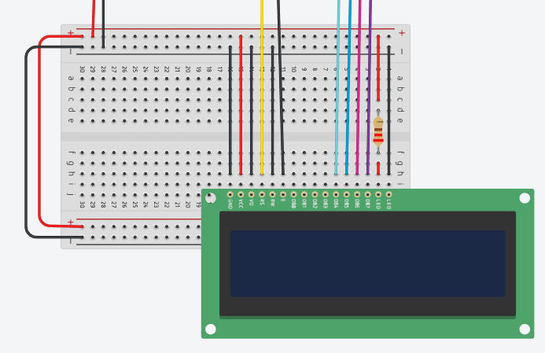

# Monitor de Força para Bola de Estresse com Arduino: Feedback com LCD e Buzzer

**Descrição:** Neste projeto, vamos desenvolver um dispositivo de monitoramento de força usando um Arduino Mega com um sensor de força, um display LCD, e um buzzer/piezo. O principal objetivo do tutorial é elaborar uma ferramenta capaz de ajudar no controle de força aplicada em um objeto, oferecendo feedback ao usuário quando certa força é atingida. Este tutorial é ideal para estudantes de eletrônica e programação, e profissionais da saúde engajados na criação de dispositivos de reabilitação e monitoramento de exercícios físicos. Dentre as habilidades que serão desenvolidas, consta-se: 
- Leitura e Interpretação de Sensores: Como configurar e ler dados de sensores analógicos, neste caso, um sensor de força;
- Programação em Arduino: Aprenderá a escrever código em C para Arduino, configurando entradas e saídas e aplicando lógica de controle;
- Controle de Display LCD: Uso do display LCD para exibir informações em tempo real, o que é essencial para projetos de interface de usuário;
- Lógica de Alerta e Feedback: Implementação de lógica para ativar um buzzer/piezo como forma de feedback quando uma condição específica é atendida;
- Prototipagem de Circuitos: Conexão de componentes como sensores, displays e atuadores em uma protoboard, promovendo habilidades de montagem e organização de circuitos.
---

## Índice

1. [Introdução](#introdução)
2. [Requisitos](#requisitos)
3. [Configuração do Ambiente](#configuração-do-ambiente)
4. [Montagem do Circuito](#montagem-do-circuito)
5. [Programação](#programação)
6. [Teste e Validação](#teste-e-validação)
7. [Expansões e Melhorias](#expansões-e-melhorias)
8. [Referências](#referências)

---

## Introdução

O monitoramento da força aplicada durante exercícios de reabilitação é essencial para verificação do progresso de pacientes em tratamentos físicos, por exemplo na recuperação muscular ou fortalemento de membros. Através do dispositivo desse tutorial implementado em uma bola de estresse, permite-se ter um acompanhamento em tempo real da força aplica pelo paciente, dando um feedback visual e sonoro toda vez que a meta estipulada é atingida. Essa ferramenta se conecta ao ambiente IoT ao ter a capacidade de receber dados por meio de sensores e, com melhorias adicionais, transmitir dados para outros sistemas. 

---

## Requisitos

### Hardware

- **Placa**: Arduino Mega ou Mega 2560.
- **Sensores**: Sensor de força (FSR).
- **Atuadores**: Buzzer e Display LCD 16x2.
- **Outros componentes**: Resistores (1kΩ e 220Ω) e uma protoboard.

### Software

- **Linguagens**: C
- **IDE**: Arduino IDE, Tinkercad(opcional)
- **Bibliotecas**: `LiquidCrystal`(para controle do display LCD).

---

## Configuração do Ambiente

### Passo 1: Instalação do Software

- **Arduino IDE**: [Baixe](https://www.arduino.cc/en/software) e instale a IDE do Arduino para programar o Arduino Uno..
- **Bibliotecas**: A biblioteca `LiquidCrystal` pode ser instalada como o exemplo mostra abaixo.

1. Procure pelo seguinte ícone, após a instalação da IDE:

2. Na área de texto escreva `LiquidCrystal` e escolha a opção "by Arduino".

### Passo 2: Configuração das Placas

- Conecte o Arduino Uno ao computador usando um cabo USB.
- Selecione sua _board_ na opção a seguir:

1. Clique em _Select other board and port_;
2. Selecione a _board_ **Arduino Mega or Mega 2560**;
3. Por fim, selecione a _Port_ de sua preferência.

---

## Montagem do Circuito

- Visualização do circuito completo. Para acessá-lo, [clique aqui](https://www.tinkercad.com/things/2YD2mYvcqbi-stress-system-with-feedback-sistema-de-estresse-com-feedback?sharecode=2uoLOfUhdeXqVENqMqu4g0_HpBEeSrgHwDb3ggKBbQA)

>[!NOTE]
>Se é sua primeira vez usando um LCD, é bem capaz que você tenha que soldar pinos nele para conectá-lo a _protoboard_ e, enfim, seguir para as Conexões do Circuito. Veja o exemplo abaixo de como ficaria a afiação do LCD após a conexão na _protoboard_:
<p align="center">
   
</p>

### Conexões do Circuito:
1. Sensor de Força:
   - Um terminal do sensor vai ser ligado ao 5V(+) da protoboard;
   - O outro terminal do sensor será conectado na coluna **d**, linha **9**. Na coluna anterior a "d", coluna **c** você puxará uma afiação para conectar ao A0 do Arduino e na coluna **b**, insira um dos terminais do resistor de 1kΩ e conecte o outro terminal na parte GND(-) da protoboard.
2. Buzzer/Piezo
   - O terminal positivo do buzzer/piezo será conectado ao pino 9 do Arduino — fio verde;
   - O terminal negativo do buzzer conecta ao GND — fio preto.
3. LCD 16x2 — Começando da Esquerda para a Direita:
   - GND do LCD para GND(-) da _protoboard_;
   - VCC do LCD para 5V(+) da _protoboard_;
   - VO para o GND(-) da _protoboard_, isso fará que o contraste do LCD esteja no máximo;
   - RS do LCD para o pino 12 do Arduino;
   - RW do LCD para o GND(-) da _protoboard_;
   - E (Enable/Ligado) do LCD para o pino 11 do Arduino;
   - DB0 até DB3 não serão usados, por isso pule eles;
   - DB4, DB5, DB6 e DB7 do LCD para os pinos 5, 4, 3 e 2 do Arduino, respectivamente;
   - LED (Backlight/Luz de Fundo) do LCD para um resistor de 220Ω e conecte esse resistor ao 5V(+) da _protoboard_;
   - O último LED, você pode conectá-lo ao GND(-) da _protoboard_.
>[!WARNING]
>Certifique-se de que todas as conexões estão firmes e corretas antes de prosseguir com a programação. Em caso de dúvida, refaça esta etapa consultando diretamente a simulação, link acima.

---

## Programação

### Passo 1: Configuração do LCD
- Esta linha inclui a biblioteca `LiquidCrystal`, permitindo que controlemos o display LCD.

```cpp
#include <LiquidCrystal.h>
```

- Aqui, estamos criando um objeto `lcd` do tipo `LiquidCrystal`. Isso possibilita que o objeto configurado controle o display LCD com os pinos específicos conectados ao Arduino.

```cpp
LiquidCrystal lcd(12, 11, 5, 4, 3, 2); //12 = RS do LCD; 11 = Enable do LCD; 5 até 2 = DB4 até DB7 do LCD
```

### Passo 2: Processamento e Lógica do Sistama

- Declaração das variáveis de pinos e limite/meta a ser alcançada.

```cpp
const int forceSensorPin = A0; // Define A0 como a entrada do sensor de força, é partir dessa declaração que iremos ler os valores de pressão aplicados
const int buzzerPin = 9; // Define o pino 9 como a saída para o buzzer/piezo
const int threshold = 350; // Define 350 como o limite da força, essa seria a meta a ser atingida
```

- Inicializar o LCD e definir pinos ou como entrada, ou como saída.

```cpp
void setup() { //A funcao void setup() e executada para configurar os pinos e inicializar o LCD
  lcd.begin(16, 2); //Inicializa o display LCD com 16 colunas e 2 linhas, configurando-o para exibir texto
  lcd.setCursor(0, 0); //Coloca o cursor na primeira linha, primeira coluna
  lcd.print("Monitor de");//Exibe "Monitor de" na primeira linha
  
  lcd.setCursor(0, 1); //Coloca o cursor na segunda linha, primeira coluna
  lcd.print("Estresse");//Exibe "Estresse" na segunda linha  

  pinMode(forceSensorPin, INPUT);//Define o pino do sensor de força como uma entrada para ler valores
  pinMode(buzzerPin, OUTPUT);//Define o pino do buzzer/piezo como saida, permitindo que o Arduino ative o buzzer

  delay(2000);//Espera 2 segundos para que o usuario possa ver a mensagem 'Monitor de Estresse'
  lcd.clear();//Limpa o display LCD para preparar as proximas informacoes
}
```

- Lógica do Sistema.

```cpp
void loop() { // a funcao void loop() e executada repetidamente, permitindo a leitura continua do sensor e atualizacao do LCD
  int forceValue = analogRead(forceSensorPin); //Le o valor analogico do sensor de forca e armazena na variavel forceValue

  lcd.setCursor(0, 0);
  lcd.print("Forca: ");
  lcd.print(forceValue); //Exibe o valor da forca medida pelo sensor no LCD
  lcd.print("    "); //Insere espaços em branco para limpar texto residual da linha anterior do LCD

  if (forceValue > threshold) { //Verifica se o valor da forca e maior que o limite definido thres
    lcd.setCursor(0, 1);
    lcd.print("Bom Trabalho!      "); 
    digitalWrite(buzzerPin, HIGH); //Ativa o buzzer/piezo, emitindo um som como feedback para o usuario
    delay(1000); //Mantem o buzzer/piezo ligado por 1 segundo                  
    digitalWrite(buzzerPin, LOW);  //Desativa o buzzer/piezo
  } else { //Caso o valor da forca seja menor que o limite, o bloco else e executado
    lcd.setCursor(0, 1);
    lcd.print("Pressione Mais!"); //Exibe a mensagem "Pressione Mais!"
  }

  delay(500);//Adiciona um atraso de meio segundo para suavizar as leituras e dar tempo para o usuario ver as mensagens
}
```


---

## Teste e Validação

Descreva os testes para validar cada parte do projeto:

1. **Testando o Sensor de Força:** Pressione o sensor de força e observe o valor exibido no LCD. O valor deve aumentar conforme a pressão aumenta.
2. **Validando o Buzzer:** Aplique pressão suficiente para exceder o limite. O buzzer deve emitir um som e o LCD deve exibir a mensagem "Bom Trabalho!".
3. **Monitoramento Contínuo:** Solte o sensor e veja a mensagem "Pressione Mais!" reaparecer. Continue testando para garantir que o sistema responde de acordo com o limite de força configurado.

---

## Expansões e Melhorias

Sugestões para melhorar o projeto, como:

- Ajuste do Limite: Adicionar um potênciometro para ajustar o limite da forca dinamicamente, sem a necessidade de modificar o código;
- Registro de Leituras: Salve os valores de força em uma memória externa ou envie para o ThingSpeak para uma análise posterior;
- Conexão com Aplicativo Móvel: Integrar o sistema com um módulo Bluetooth para enviar dados para um aplicativo móvel e monitorar o progresso remotamente;
- Alarme Vibratório: Substitua ou adicione como complemento ao buzzer/piezo um motor vibratório para feedback silencioso.

---

## Referências

1. [Documentação da Biblioteca LiquidCrystal](https://docs.arduino.cc/libraries/liquidcrystal/)
2. [Tinkercad - Circuitos e Simulação de Arduino](https://www.tinkercad.com/)

---

