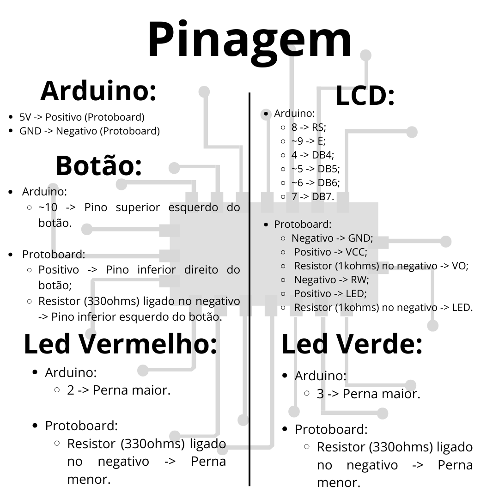

# Sistema de Alerta para Monitoramento de Pacientes

**Descrição:** Criação de um circuito utilizando Arduino Mega para indicar um estado de socorro de um paciente.

---

## Índice

1. [Introdução](#introdução)
2. [Requisitos](#requisitos)
3. [Configuração do Ambiente](#configuração-do-ambiente)
4. [Montagem do Circuito](#montagem-do-circuito)
5. [Programação](#programação)
6. [Teste e Validação](#teste-e-validação)
7. [Expansões e Melhorias](#expansões-e-melhorias)
8. [Referências](#referências)

---

## Introdução
O princípio deste circuito está na possibilidade de acionar uma equipe médica o mais rapido possível. Assim caso ocorra algum acidente como queda, piora repentina de algum sintoma e entre outros incidentes o paciente pode ligeiramente acionar o socorro. Dessa maneira, como se trata de um circuito simples pode ser facilmente instalado em casa de pessoas que necessitam de supervisionamento.

---

## Requisitos

### Hardware

- **Placa**: Arduino Mega;
- **Sensores**: Botão;
- **Atuadores**: Dois leds (Verde: Estado Normal; Vermelho: Estado Emergência);
- **Outros componentes**: Protoboard (fins educacionais), 5 resistores (3 de 330ohms e 2 de 1kohms), jumpers, 1 LCD, cabo usb.

### Software

- **Linguagens**: C para Arduino via Arduino IDE;
- **IDE**: Arduino IDE, Tinkercad (Opcional);
- **Bibliotecas**: LiquidCrystal (LCD).

---

## Configuração do Ambiente

### Passo 1: Instalação do Software

- **Arduino IDE**: Por meio do link (https://www.arduino.cc/en/software) faça o download do software que usaremos para programar a placa;
- **Bibliotecas**: Como instalar a biblioteca necessária:
  
1. Após instalar o Arduino IDE procure por:
  
  

2. Na área de texto digite "LiquidCrystal" e instale o que está escrito by Arduino;

### Passo 2: Configuração da Placa

- **Arduino**: Passos para configurar a placa e selecionar a porta correta na IDE:
1. Conecte o arduino no computador via cabo usb;
2. Clique em:

   
3. Clique em Select other board and port;
4. Selecione a board Arduino Mega or Mega 2560;
5. Por fim selecionar a Port.

---

## Montagem do Circuito

- Para montar o circuito será necessário muita atenção ao manusear os cabos, se atente as portas e siga as imagens abaixo:


- Pinagem:



---

## Programação

### Passo 1: Configuração do LCD

- Com o circuito montado, vamos configurar o LCD no Arduino IDE:
  
```cpp
#include <LiquidCrystal.h> // Inclui a biblioteca para utilizar o LCD.

LiquidCrystal lcd(8,9,4,5,6,7);// Configuração das portas do LCD.
```

### Passo 2: Lógica do Sistema de Alerta

- Após configurar o LCD, vamos adicionar a lógica para o funcionamento do sistema
  
```cpp
// Definindo as portas dos LEDs e do botão.
#define LedVerm 2
#define LedVerd 3
#define BotAlert 10

int bot = 0; // Variável para guardar o estado do botão.
int cont = 0; // Contador para o loop do alerta.

// Lê o estado do botão.
void lerBot()
{
  bot = digitalRead(BotAlert);
}

// Liga o LED verde.
void ligaVerd()
{
  digitalWrite(LedVerd, HIGH);
}
// Desliga o LED verde.
void desligaVerd()
{
  digitalWrite (LedVerd,LOW);
}

// Písca o LED vermelho.
void PiscaVerm()
{
  digitalWrite(LedVerm, HIGH);
  delay(100);
  digitalWrite(LedVerm,LOW);
}

// Indica que o sistema está em estado normal e liga o LED verde.
void Padrao()
{
  lcd.setCursor(3,0);
  lcd.print("Sistema em:");
  lcd.setCursor(2,1);
  lcd.print("Estado Normal");
  ligaVerd();
}

// Aciona o modo de alerta e pisca o LED vermelho.
void Alerta()
{
  lcd.clear();
  lcd.setCursor(4,0);
  lcd.print("ALERTA!!!!!!!");
  PiscaVerm();
  delay(200);
  lcd.clear();
}

// Configuração inicial dos pinos.
void setup()
{
  Serial.begin(9600);
  lcd.begin(16,2);
  delay(500);
  pinMode(LedVerm, OUTPUT);
  pinMode(LedVerd, OUTPUT);
  pinMode(BotAlert, INPUT);
}
// Loop principal onde verifica o estado do botão, desliga o LED verde e aciona o estado de alerta.
void loop()
{
  cont = 0;
  lerBot();
  if (bot == HIGH)
  {
    desligaVerd();
    delay(400);
    for(cont;cont <= 5; cont++){
      Alerta();
      delay(400);
    }
  }else { // Caso o Botão fique em LOW o código mantém o padrão.
    Padrao();
  }
}
```
---

## Teste e Validação

1. **Testando Atuadores**: Verifique o funcionamento dos leds, vermelho deve ligar apenas ao pressionar o botão e o verde deve ficar ligado até o botão ser pressionado;
2. **Validação dos Sensores**: Confirme que ao apertar o botão, ligue o led vermelho e mude a mensagem do LCD;
3. **Estado Normal**: Verifique se após um intervalo de tempo a mensagem do LCD volte ao estado normal e ligue o led verde. 

---

## Expansões e Melhorias

- Modulo ESP32 para comunicação WIFI com algum dispositivo móvel;
- Ao invés do botão, optar por outros sensores como de temperatura (DHT11), de gás (MQ-2,MQ-7) ou até sensores de queda;
- Comunicação com nuvém para armazenar métricas captadas pelos sensores.

---

## Referências

1. https://www.tinkercad.com/things/1unuX2OeU4X-sistema-de-alerta-para-monitoramento-de-pacientes?sharecode=9TAe8z6p8THZwofrSDmh2QAxmH0FTaxHn06dodB2yvQ
2. https://docs.arduino.cc/libraries/liquidcrystal/
3. https://www.arduino.cc/en/software
   
---
