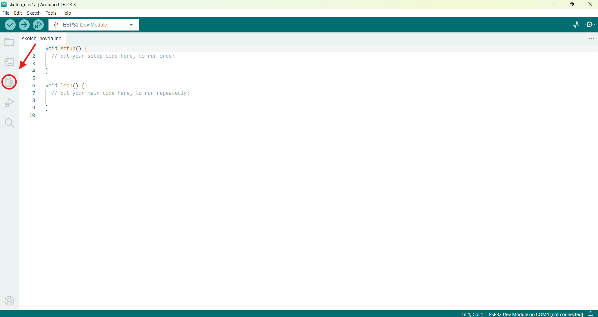

# Sistema de Alerta com Arduino Mega

**Descrição:** Criação de um circuito utilizando Arduino Mega para indicar um estado de socorro de um paciente, por meio de uma botão.

---

## Índice

1. [Introdução](#introdução)
2. [Requisitos](#requisitos)
3. [Configuração do Ambiente](#configuração-do-ambiente)
4. [Montagem do Circuito](#montagem-do-circuito)
5. [Programação](#programação)
6. [Teste e Validação](#teste-e-validação)
7. [Expansões e Melhorias](#expansões-e-melhorias)
8. [Referências](#referências)

---

## Introdução
O princípio deste circuito está na possibilidade de acionar uma equipe médica o mais rapido possível. Assim caso ocorra algum acidente como queda, piora repentina de algum sintoma e entre outros incidentes o paciente pode ligeiramente acionar o socorro. Dessa maneira, como se trata de um circuito simples pode ser facilmente instalado em casa de pessoas que necessitam de supervisionamento.

---

## Requisitos

### Hardware

- **Placa**: Arduino Mega;
- **Sensores**: Botão;
- **Atuadores**: Dois Led's (Verde: Estado Normal; Vermelho: Estado Emergência);
- **Outros componentes**: Protoboard(fins educacionais), 5 resistores(3 de 330ohms e 2 de 1kohms), jumpers, 1 Lcd, cabo usb.

### Software

- **Linguagens**: C para Arduino via Arduino IDE;
- **IDE**: Arduino IDE, Tinkercad(Opcional);
- **Bibliotecas**: LiquidCrystal(Lcd).

---

## Configuração do Ambiente

### Passo 1: Instalação do Software

- **Arduino IDE**: Por meio do link (https://www.arduino.cc/en/software) faça o download software que usaremos para programar a placa;
- **Bibliotecas**: Como instalar a biblioteca necessária:
1. Após instalar o Arduino IDE procure por:
  
  

2. Na área de texto digite "LiquidCrystal" e instale a que está escrito by Arduino;

### Passo 2: Configuração das Placas

- **Arduino**: Passos para configurar a placa e selecionar a porta correta na IDE:
1. Conecte o arduino no computador via cabo usb;
2. Clique em:

   
3. Clique em Select other board and port;
4. Selecione a board Arduino Mega or Mega 2560;
5. Por fim seleciona a Port.

---

## Montagem do Circuito

-Para montar o circuito será necessário muita atenção ao manusear os cabos, se atente as portas e siga a imagem abaixo:


---

## Programação

### Passo 1: Configuração do do Lcd
-Com o circuito montado, vamos configurar o Lcd no Arduino IDE:
```cpp
#include <LiquidCrystal.h>

LiquidCrystal lcd(8,9,4,5,6,7);
```

### Passo 2: Processamento e Lógica de Alerta

Adicione a lógica para processar os dados e acionar atuadores, como LEDs ou buzzer, caso as leituras excedam um determinado limite.

---

## Teste e Validação

Descreva os testes para validar cada parte do projeto:

1. **Testando Sensores**: Verifique se as leituras são consistentes e corretas.
2. **Validação dos Atuadores**: Confirme que os atuadores funcionam corretamente.
3. **Monitoramento em Tempo Real**: Teste o sistema completo em condições simuladas para garantir que funciona conforme o esperado.

---

## Expansões e Melhorias

Sugestões para melhorar o projeto, como:

- Adicionar comunicação Wi-Fi (ESP32) para enviar dados para uma nuvem.
- Integrar um banco de dados para registro das leituras.
- Conectar-se a uma aplicação móvel para visualização remota.

---

## Referências

Liste todas as referências e links úteis para guias, bibliotecas, e materiais adicionais que ajudem a complementar o tutorial.

---

Espero que esse modelo ajude a organizar o conteúdo e fornecer uma estrutura clara e completa para tutoriais de IoT no contexto da saúde.
